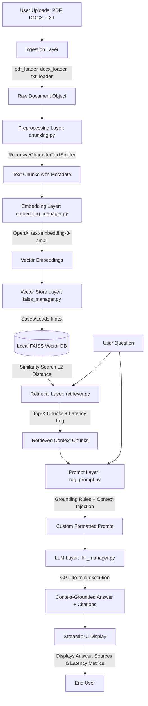

# 🎓 LLM-Powered AI Research Assistant (RAG)

An end-to-end Retrieval-Augmented Generation (RAG) application that allows users to upload research papers and documents (PDFs, DOCX, TXT), then ask natural language questions and receive context-aware answers fully grounded in the uploaded materials with precise source citations.

This repository is built following clean software engineering practices, modular coding standards, and security protocols, making it suitable for a **Data Science or AI Engineer internship portfolio**.

---

## 🏗️ Architecture Diagram

Below is the conceptual architecture of the Retrieval-Augmented Generation (RAG) pipeline:



---

## 🧠 Core Concepts Explained

### 1. How Embeddings Work
An embedding model converts a piece of text (word, sentence, or chunk) into a high-dimensional vector of floating-point numbers (e.g., 1536 dimensions for `text-embedding-3-small`). 
* The vectors are positioned in a vector space such that words or sentences with **similar semantic meaning** are physically located close to each other.
* Unlike basic keyword matching, embeddings capture the **contextual meaning** of words, enabling the system to understand synonyms, phrasing variations, and semantic intent.

### 2. How FAISS Works
**FAISS** (Facebook AI Similarity Search) is a highly optimized library for efficient similarity search and clustering of dense vectors.
* When document chunks are embedded, they are stored as vectors in a FAISS index.
* During query time, FAISS calculates the distance (typically Euclidean L2 distance or Cosine Similarity) between the query vector and all document vectors in the database.
* By using indexing algorithms, FAISS performs this search in milliseconds, even across millions of vectors, making it much faster than brute-force scanning.

### 3. How Retrieval Works
1. The user inputs a query (e.g., "What were the main findings in the 2024 paper?").
2. The query is passed to the embedding manager, which generates its vector representation.
3. The query vector is sent to the FAISS index, which retrieves the **Top-K** (e.g., 4) most similar document vector chunks.
4. The system logs the retrieval process, capturing details such as search latency and chunk similarity scores.

### 4. How Context is Passed to the LLM
The retrieved text chunks, along with their metadata (such as file name and page number), are compiled into a single formatted string.
* This context string is injected into a **custom prompt template**.
* The prompt structure separates the document context and the user query, clearly defining the boundaries using markdown separators.
* The complete prompt containing both the context and the question is then dispatched in a single API call to the LLM (GPT-4o-mini).

### 5. How Hallucinations are Reduced
We implement a multi-tiered approach to maximize truthfulness:
* **Context Grounding Rules**: The LLM is explicitly instructed to rely *only* on the provided context.
* **Strict Failure Handler**: If the answer cannot be verified from the context, the model must reply with the exact phrase: *"I'm sorry, but I cannot find the answer in the uploaded documents."*
* **Inline Citation Enforcements**: The model is instructed to cite source documents and page numbers for every claim, ensuring auditability.
* **Similarity Distance Tracking**: We expose the L2 distance scores of retrieved chunks to verify semantic alignment.

---

## 📂 Project Directory Structure

```text
rag-research-assistant/
├── app.py                   # Main Streamlit web application interface
├── requirements.txt         # Python package dependencies
├── README.md                # Comprehensive documentation
├── .env.example             # Configuration settings template
│
├── src/
│   ├── ingestion/
│   │   ├── __init__.py
│   │   ├── pdf_loader.py    # PyPDFLoader wrapper for PDF extraction
│   │   ├── docx_loader.py   # Docx2txtLoader wrapper for Word documents
│   │   └── txt_loader.py    # TextLoader wrapper for plain text files
│   │
│   ├── preprocessing/
│   │   ├── __init__.py
│   │   └── chunking.py      # RecursiveCharacterTextSplitter helper
│   │
│   ├── embeddings/
│   │   ├── __init__.py
│   │   └── embedding_manager.py  # OpenAIEmbeddings configuration
│   │
│   ├── vectorstore/
│   │   ├── __init__.py
│   │   └── faiss_manager.py # FAISS vector database wrapper
│   │
│   ├── retrieval/
│   │   ├── __init__.py
│   │   └── retriever.py     # Similarity search & retrieval latency tracking
│   │
│   ├── prompts/
│   │   ├── __init__.py
│   │   └── rag_prompt.py    # Custom prompt engineering template
│   │
│   ├── llm/
│   │   ├── __init__.py
│   │   └── llm_manager.py   # ChatOpenAI client configuration
│   │
│   └── pipeline/
│       ├── __init__.py
│       └── rag_pipeline.py  # Orchestrator tying the RAG components together
│
├── data/
│   └── uploads/             # Stores uploaded documents securely (renamed to UUIDs)
└── vectorstore/             # Local storage directory for FAISS index files
```

---

## ⚙️ Installation & Local Setup

### 1. Prerequisites
Ensure you have **Python 3.11** or higher installed.

### 2. Clone and Navigate
```bash
cd rag-research-assistant
```

### 3. Install Dependencies
```bash
pip install -r requirements.txt
```

### 4. Environment Configuration
Create a `.env` file from the example template:
```bash
cp .env.example .env
```
Open `.env` and fill in your OpenAI API Key:
```env
OPENAI_API_KEY=sk-...
MODEL_NAME=gpt-4o-mini
```

### 5. Running the Application
Launch the Streamlit server locally:
```bash
streamlit run app.py --server.address 127.0.0.1
```
The browser window will open automatically at `http://127.0.0.1:8501`.

---

## 🛡️ Security Implementation Details

This codebase strictly implements security best practices:
1. **Path Traversal Protection**: Uploaded files are renamed to unique UUID strings and saved to a dedicated directory outside the web root. Traversal attempts via malicious filenames (e.g. `../../etc/passwd`) are thwarted as we extract only the extension and generate random names.
2. **Denial of Service (DoS) Prevention**: A strict file size limit of **10MB** is enforced inside the Streamlit frontend. Files exceeding this size are blocked from processing.
3. **Safe Vector Store Operations**: FAISS `load_local` requires `allow_dangerous_deserialization=True` which exposes pickle vulnerabilities if loading untrusted files. We mitigate this by checking paths against our local sandboxed directory (`vectorstore/`) to ensure only locally generated indices are parsed.
4. **Environment Variables Over Hardcoding**: No secret keys, passwords, or credentials are hardcoded. The application verifies `.env` values and provides an input in the sidebar to prevent accidental commits of API keys.

---

## 📊 Evaluation Metrics Tracked
The application measures and displays real-time execution statistics for every query:
* **Retrieval Latency (ms)**: Time taken to perform vector similarity search.
* **Generation Latency (ms)**: Time taken for the LLM to complete inference and stream the answer.
* **Total Execution Time (ms)**: Overall duration of the request lifecycle.
* **Number of Chunks Retrieved**: Number of text blocks injected into context.
* **Source Tracking**: Original file names and pages cited in retrieved chunks.

---

## 📸 Example Screenshots Placeholder

*Below are typical views when running the dashboard:*
* **Ingestion and Parameter Control Sidebar**: Adjust chunking parameters dynamically.
* **Metrics Dashboard**: Display latency graphs and performance statistics.
* **Chat Grounding demo**: Displays answers alongside citation source expansion lists.
